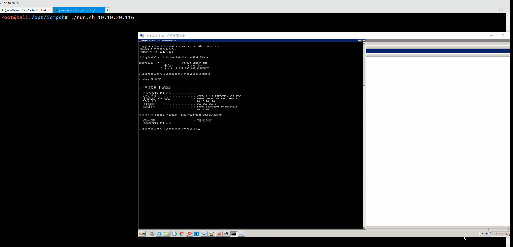

## Background

Sometimes, network administrators make the penetration tester's life harder. Some of them do use firewalls for what they are meant to, surprisingly!
Allowing traffic only onto known machines, ports and services (ingress filtering) and setting strong egress access control lists is one of these cases. In such scenarios when you have owned a machine part of the internal network or the DMZ (e.g. in a Citrix breakout engagement or similar), it is not always trivial to get a reverse shell over TCP, not to consider a bind shell.

However, what about UDP (commonly a DNS tunnel) or ICMP as the channel to get a reverse shell? ICMP is the focus on this tool.

## Description

icmpsh is a simple reverse ICMP shell with a win32 slave and a POSIX compatible master in C, Perl or Python. The main advantage over the other similar open source tools is that it does not require administrative privileges to run onto the target machine.

The tool is clean, easy and portable. The **slave (client) runs on the target Windows machine**, it is written in C and works on Windows only whereas the **master (server) can run on any platform on the attacker machine** as it has been implemented in C and Perl by [Nico Leidecker](http://www.leidecker.info/) and I have ported it to Python too, hence this GitHub fork.

## Features

* Open source software - primarily coded by Nico, forked by me.
* Client/server architecture.
* The master is portable across any platform that can run either C, Perl or Python code.
* The target system has to be Windows because the slave runs on that platform only for now.
* The user running the slave on the target system does not require administrative privileges.

## Usage

### Running the master

The master is straight forward to use. There are no extra libraries required for the C and Python versions. The Perl master however has the following dependencies:

* IO::Socket
* NetPacket::IP
* NetPacket::ICMP

When running the master, don't forget to disable ICMP replies by the OS. For example:
```
sysctl -w net.ipv4.icmp_echo_ignore_all=1
```

If you miss doing that, you will receive information from the slave, but the slave is unlikely to receive commands send from the master.

### Running the slave

The slave comes with a few command line options as outlined below:

```
-t host            host ip address to send ping requests to. This option is mandatory!

-r                 send a single test icmp request containing the string "Test1234" and then quit. 
                   This is for testing the connection.

-d milliseconds    delay between requests in milliseconds 

-o milliseconds    timeout of responses in milliseconds. If a response has not received in time, 
                   the slave will increase a counter of blanks. If that counter reaches a limit, the slave will quit.
                   The counter is set back to 0 if a response was received.

-b num             limit of blanks (unanswered icmp requests before quitting

-s bytes           maximal data buffer size in bytes
```

In order to improve the speed, lower the delay (*-d*) between requests or increase the size (-s) of the data buffer.

## License

This source code is free software; you can redistribute it and/or modify it under the terms of the GNU Lesser General Public License as published by the Free Software Foundation; either version 2.1 of the License, or (at your option) any later version.

This library is distributed in the hope that it will be useful, but WITHOUT ANY WARRANTY; without even the implied warranty of MERCHANTABILITY or FITNESS FOR A PARTICULAR PURPOSE. See the GNU Lesser General Public License for more details.

You should have received a copy of the GNU Lesser General Public License along with this library; if not, write to the Free Software Foundation, Inc., 51 Franklin Street, Fifth Floor, Boston, MA 02110-1301 USA
